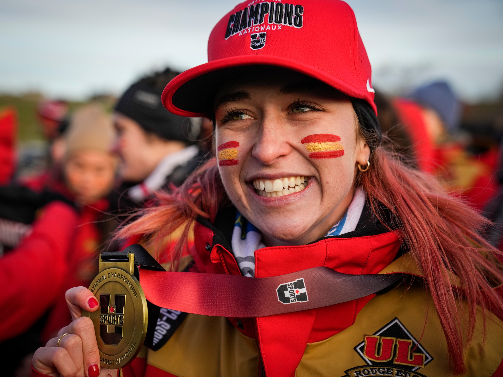
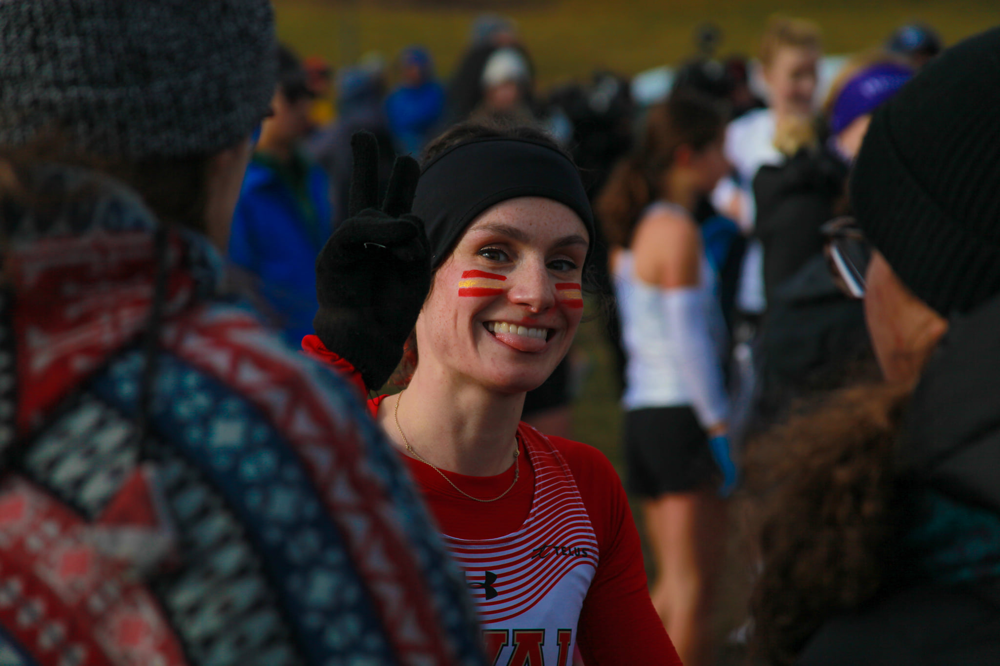
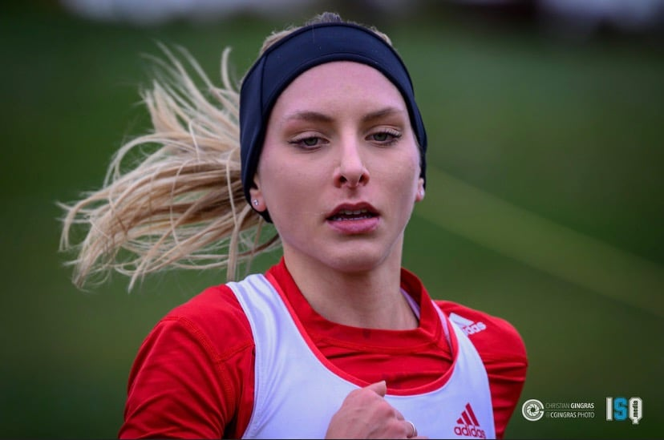
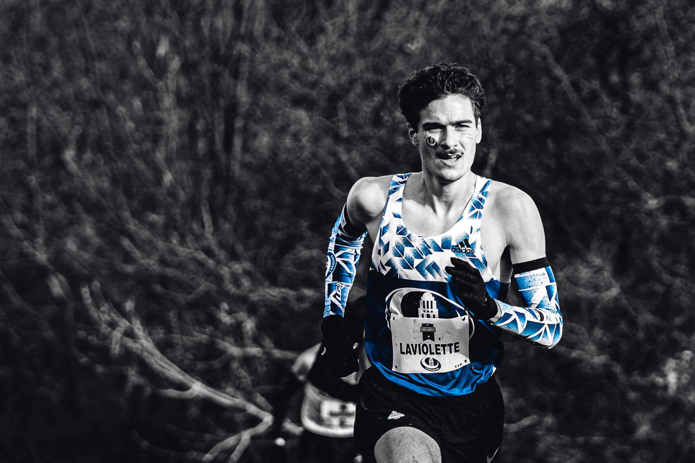
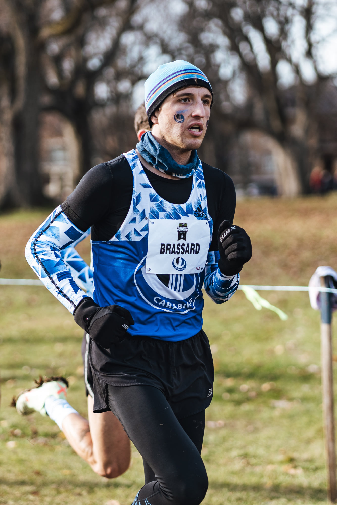

## Chez les femmes : Jade et Camille écrivent l’histoire avec le Rouge et Or

**Camille Riopel** 59e position (31:14) ainsi que l'ancienne du COCH **Jade Bérubé** en 9e position (29:13) sont championnes nationales USports par équipe sur les Plaines d'Abraham, une première pour une équipe féminine d'une université québécoise de remporter l'or à la maison!!! À noter que les deux femmes se sont classées sur l'alignement extrêmement relevé du Rouge et Or de l'université Laval suite à leur excellente performance lors des championnats provinciaux, où Camille termine 11e et se taille une place sur la 2e équipe d'étoiles RSEQ et où Jade réalise son premier podium provincial, décrochant la médaille de bronze et une première équipe d'étoile du championnat provincial RSEQ!

Mention spéciale à **Chloe Gregoire**, également ancienne au club, qui termine sa 5e année universitaire en cross country avec une impressionnante 34e position nationale (30:33) en menant les femmes de l'Université McGill! Chloé sera également en action la semaine prochaine à Ottawa, représentant l'équipe du Québec aux [#ACXC2021](https://www.facebook.com/hashtag/acxc2021).

Bravo les filles!

## Chez les hommes : Thomas Laviolette et Louis-Olivier Brassard piliers des Carabins de l’UdeM

**Thomas Laviolette** 49e (26:13) mène la voie chez les hommes des carabins de l'UdeM en livrant une excellente performance à ses premiers USports!
**Louis-Olivier Brassard** en 86e position (27:01) qui consolide son retour impressionnant sur le circuit universitaire en finissant près derrière Thomas, en réalisant une belle gestion de course avec une dernière portion rapide fidèle à ses habitudes!
Les deux hommes ont chacun réalisés une performance supérieure par rapport à celle des championnats provinciaux du mois précédent, également sur les Plaines d'Abraham!

Bravo les gars!

