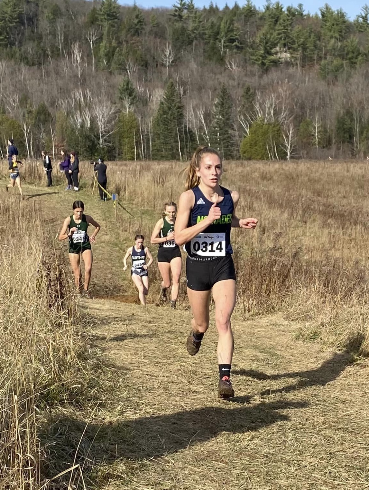

Suite à leur performance lors des championnats québécois à Rawdon, des deux athlètes du club prendront part aux championnats canadiens de cross-country ce mois-ci.

## Une première équipe du Québec pour Coralie Bouchard

_Coralie Bouchard (photo: Olivier Lavoie)._

L’athlète représentant également les Nomades du collège Montmorency a obtenu le sixième rang sur le parcours particulièrement boueux de Rawdon, bouclant les six kilomètres en 24 minutes 17 secondes.

Il s’agit d’une première expérience sur les équipes du Québec pour Coralie, elle qui devient la deuxième athlète féminine de l’histoire du club à être sélectionnée sur une équipe de cross-country.

Son entraîneur, Olivier Lavoie, compte d’ailleurs parmi le personnel d’encadrement de la délégation québécoise.

## Thomas Laviolette au pied du podium et poursuit sa progression fulgurante

_Thomas Laviolette (photo: Murielle Aglot)._

Courant simultanément sous la bannière des Carabins de Montréal, l’étudiant en génie aérospatiale à Polytechnique Montréal s’est classé au quatrième rang, parcourant les huit kilomètres en 25 minutes 13 secondes, à quatre secondes du podium.
Son rang lui a d’ailleurs permis de rejoindre la première équipe d’étoiles du RSEQ.

---

Les championnats canadiens de cross-country se tiendront dans la ville d’Ottawa le 26 novembre prochain.

D’ici là, nos deux athlètes s’illustreront dans leur championnat national respectif, soit le championnat CCAA au niveau collégial pour Coralie à Medicine Hat (Alberta) et le championnat U Sports au niveau universitaire pour Thomas à Halifax (Nouvelle-Écosse), samedi 12 novembre 2022.